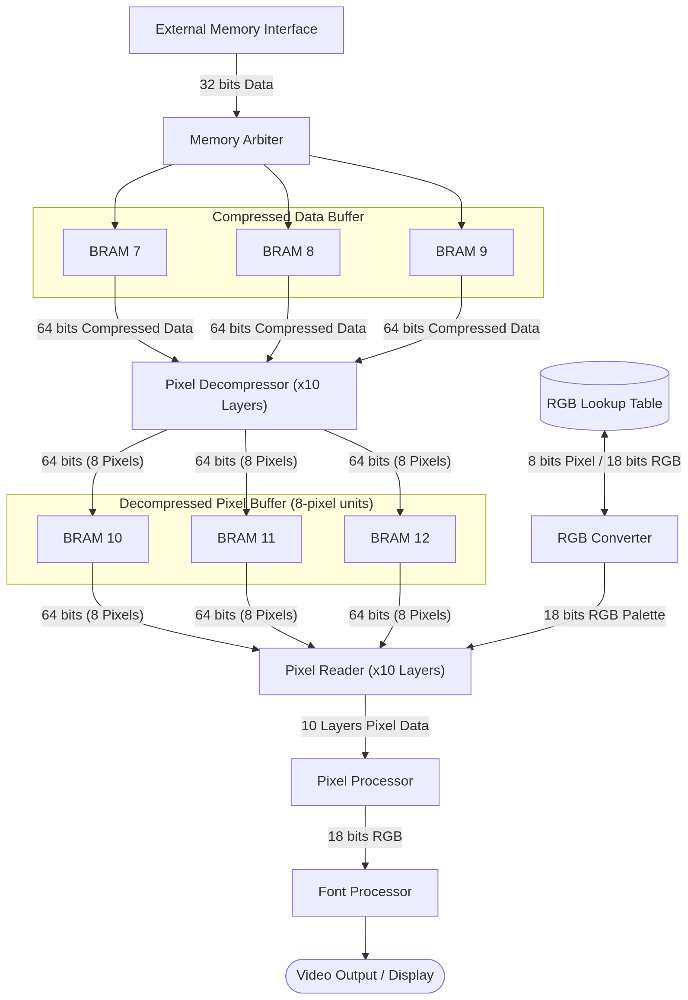
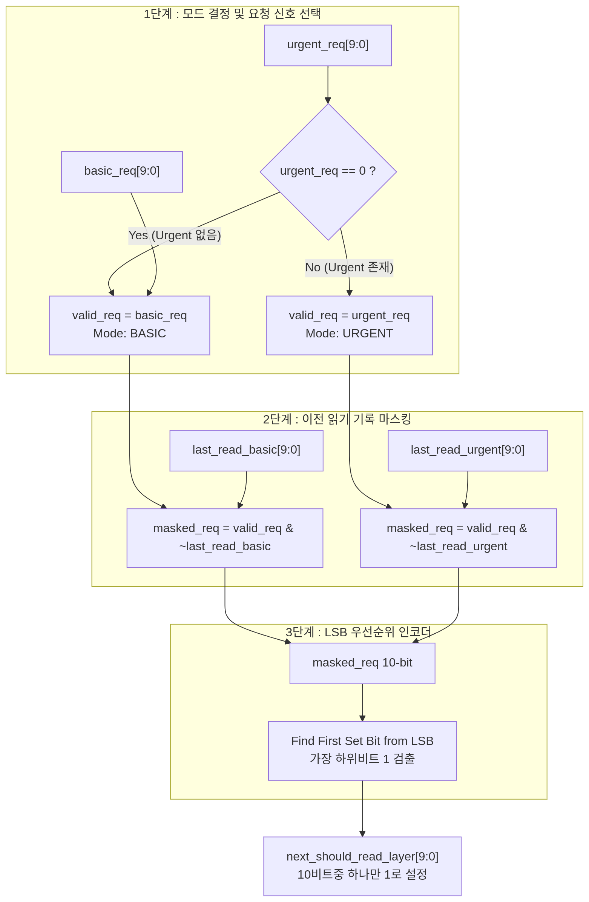
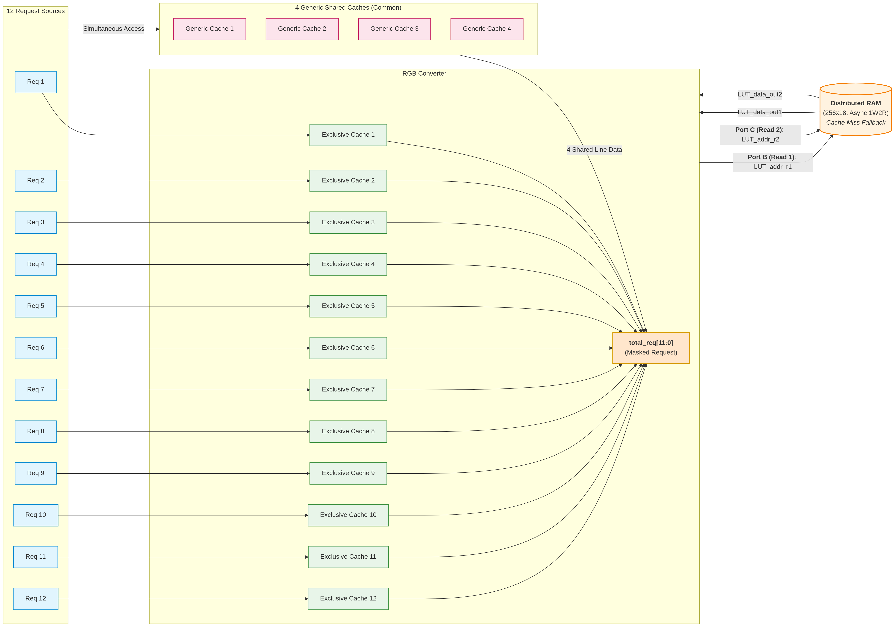

# Overview

비주얼 노벨 장르 게임 구동을 목적으로 하는 게임 시스템의 PPU(Pixel Processing Unit)입니다. 320 * 240 픽셀 화면에 255개의 팔래트를 지원하며 외부 메모리에 RLC(Run Length Coding) 압축 저장된 10개의 레이어 이미지를 실시간 합성, 알파블랜딩, 폰트 합성하여 화면을 출력합니다. 

## System Features
* 클럭 속도: 
* 픽셀 수: 320 * 240
* 레이어 수: 10개 (400 * 320 2개, 320 * 240  2개, 160 * 240  5개, 320 *  120 1개 지원)
* 팔래트 수: 255개
* 10단계 레이어 알파 블랜딩 지원
* 한글, ASCII 폰트 랜더링 지원
* 커스텀 8 * 16 단색 타일 지원
* RLC(Run Length Coding) 압축 지원

## Resister Map
Background_Layer1_Address 
Background_Layer2_Address 
Character_Layer1_Address 
Character_Layer2_Address 
Character_Layer3_Address 
Character_Layer4_Address
Script_Layer_Address
Status_Layer_Address
Universal_Layer1_Address
Universal_Layer2_Address
CPU_LUT_Cache1_pixel
CPU_LUT_Cache2_pixel
CPU_LUT_Cache3_pixel
CPU_LUT_Cache4_pixel
Background1_SCX 
Background1_SCY 
Background1_a
Background1_z 
Background2_SCX 
Background2_SCY 
Background2_a
Background2_z 
Character1_WX
Character1_WY 
Character1_a 
Character1_z 
Character2_WX
Character2_WY 
Character2_a 
Character2_z 
Character3_WX
Character3_WY 
Character3_a 
Character3_z 
Character4_WX
Character4_WY 
Character4_a 
Character4_z 
Script_WX 
Script_WY 
Script_a 
Script_z
Status_WX 
Status_WY 
Status_a 
Status_z 
Universal1_WX 
Universal1_WY 
Universal1_a 
Universal1_z 
Universal2_WX 
Universal2_WY 
Universal2_a 
Universal2_z 
Line0_visible_number 
Line0_font_RGB_9bit
Line0_a
Line1_visible_number 
Line1_font_RGB_9bit
Line1_a
Line2_visible_number 
Line2_font_RGB_9bit
Line2_a
Line3_visible_number 
Line3_font_RGB_9bit
Line3_a
Line4_visible_number 
Line4_font_RGB_9bit
Line4_a
Line5_visible_number 
Line5_font_RGB_9bit
Line5_a
Line6_visible_number 
Line6_font_RGB_9bit
Line6_a
Line7_visible_number 
Line7_font_RGB_9bit
Line7_a
Line8_visible_number 
Line8_font_RGB_9bit
Line8_a
Line9_visible_number 
Line9_font_RGB_9bit
Line9_a
Line10_visible_number 
Line10_font_RGB_9bit
Line10_a
Line11_visible_number 
Line11_font_RGB_9bit
Line11_a
Line12_visible_number 
Line12_font_RGB_9bit
Line12_a
Line13_visible_number 
Line13_font_RGB_9bit
Line13_a
Line14_visible_number 
Line14_font_RGB_9bit
Line14_a

## BRAM overview
### BRAM 4 (True Dual-Port)
|주소 범위(십진수)  |데이터 크기|데이터 항목       |비고|
| :--- | :--- | :--- | :--- |
|0 - 151            |32 bits    |한글 폰트 초성 1벌||
|152 - 303          |32 bits    |한글 폰트 초성 2벌||
|304 - 455          |32 bits    |한글 폰트 초성 3벌||
|456 - 607          |32 bits    |한글 폰트 초성 4벌||
|608 - 759          |32 bits    |한글 폰트 초성 5벌||
|760 - 911          |32 bits    |한글 폰트 초성 6벌||
|912 - 1023         |32 bits    |비어 있음         ||

### BRAM 5 (True Dual-Port)
|주소 범위(십진수)  |데이터 크기|데이터 항목       |비고|
| :--- | :--- | :--- | :--- |
|0 - 151            |32 bits    |한글 폰트 초성 7벌||
|152 - 303          |32 bits    |한글 폰트 초성 8벌||
|304 - 687          |32 bits    |ASCII 문자 폰트   ||
|688 - 1023         |32 bits    |Custom Tile 비트맵||

### BRAM 6 (True Dual-Port)
|주소 범위(십진수)  |데이터 크기|데이터 항목       |비고|
| :--- | :--- | :--- | :--- |
|0 - 167            |32 bits    |한글 폰트 중성 1벌||
|168 - 335          |32 bits    |한글 폰트 중성 2벌||
|336 - 503          |32 bits    |한글 폰트 중성 3벌||
|504 - 671          |32 bits    |한글 폰트 중성 4벌||
|672 - 1023         |32 bits    |Custom Tile 비트맵||

### BRAM 7 (Simple Dual-Port)
|주소 범위(십진수)  |데이터 크기|데이터 항목                          |비고|
| :--- | :--- | :--- | :--- |
|0 - 127            |64 bits    |Universal Layer1 Compressed Data FIFO|외부 메모리에서 읽어온 값 저장|
|128 - 255          |64 bits    |Universal Layer2 Compressed Data FIFO||
|256 - 383          |64 bits    |Script Layer Compressed Data FIFO    ||
|384 - 511          |64 bits    |Status Layer Compressed Data FIFO    ||

### BRAM 8 (Simple Dual-Port)
|주소 범위(십진수)  |데이터 크기|데이터 항목                          |비고|
| :--- | :--- | :--- | :--- |
|0 - 127            |64 bits    |Character Layer1 Compressed Data FIFO|외부 메모리에서 읽어온 값 저장|
|128 - 255          |64 bits    |Character Layer2 Compressed Data FIFO||
|256 - 383          |64 bits    |Character Layer3 Compressed Data FIFO||
|384 - 511          |64 bits    |Character Layer4 Compressed Data FIFO||

### BRAM 9 (Simple Dual-Port)
|주소 범위(십진수)  |데이터 크기|데이터 항목                           |비고|
| :--- | :--- | :--- | :--- |
|0 - 255            |64 bits    |Background Layer1 Compressed Data FIFO|외부 메모리에서 읽어온 값 저장|
|256 - 511          |64 bits    |Background Layer2 Compressed Data FIFO||

### BRAM 10 (Simple Dual-Port)
|주소 범위(십진수)  |데이터 크기|데이터 항목                            |비고|
| :--- | :--- | :--- | :--- |
|0 - 127            |64 bits    |Universal Layer1 Decompressed Data FIFO|RLC 압축해제 한 8비트 픽셀 값 8개씩 저장|
|128 - 255          |64 bits    |Universal Layer2 Decompressed Data FIFO||
|256 - 383          |64 bits    |Script Layer Decompressed Data FIFO    ||
|384 - 511          |64 bits    |Status Layer Decompressed Data FIFO    ||

### BRAM 11 (Simple Dual-Port)
|주소 범위(십진수)  |데이터 크기|데이터 항목                            |비고|
| :--- | :--- | :--- | :--- |
|0 - 127            |64 bits    |Character Layer1 Decompressed Data FIFO|RLC 압축해제 한 8비트 픽셀 값 8개씩 저장|
|128 - 255          |64 bits    |Character Layer2 Decompressed Data FIFO||
|256 - 383          |64 bits    |Character Layer3 Decompressed Data FIFO||
|384 - 511          |64 bits    |Character Layer4 Decompressed Data FIFO||

### BRAM 12 (Simple Dual-Port)
|주소 범위(십진수)  |데이터 크기|데이터 항목                             |비고|
| :--- | :--- | :--- | :--- |
|0 - 255            |64 bits    |Background Layer1 Decompressed Data FIFO|RLC 압축해제 한 8비트 픽셀 값 8개씩 저장|
|256 - 511          |64 bits    |Background Layer2 Decompressed Data FIFO||

### BRAM 13 (True Dual-Port)
|주소 범위(십진수)  |데이터 크기|데이터 항목       |비고|
| :--- | :--- | :--- | :--- |
|0 - 223            |32 bits    |한글 폰트 종성 1벌||
|224 - 447          |32 bits    |한글 폰트 종성 2벌||
|448 - 671          |32 bits    |한글 폰트 종성 3벌||
|672 - 895          |32 bits    |한글 폰트 종성 4벌||
|896 - 1023         |32 bits    |비어 있음         ||

### BRAM 14 (True Dual-Port)
|주소 범위(십진수)  |데이터 크기|데이터 항목       |비고|
| :--- | :--- | :--- | :--- |
|0 - 19           |32 bits    |Line0 Font Map|한 Line 당 최대 40개의 UTF-16 코드를 작성 가능함.|
|20 - 39          |32 bits    |Line1 Font Map||
|40 - 59          |32 bits    |Line2 Font Map||
|60 - 79          |32 bits    |Line3 Font Map||
|80 - 89          |32 bits    |Line4 Font Map||
|100 - 119        |32 bits    |Line5 Font Map||
|120 - 139        |32 bits    |Line6 Font Map||
|140 - 159        |32 bits    |Line7 Font Map||
|160 - 179        |32 bits    |Line8 Font Map||
|180 - 199        |32 bits    |Line9 Font Map||
|200 - 219        |32 bits    |Line10 Font Map||
|220 - 239        |32 bits    |Line11 Font Map||
|240 - 259        |32 bits    |Line12 Font Map||
|260 - 279        |32 bits    |Line13 Font Map||
|280 - 299        |32 bits    |Line14 Font Map||
|300 - 1023       |32 bits    |비어 있음      ||

## Sub-Module Specification

### Compressed_Data_FIFO.sv
10개 레이어의 압축 데이터(Compressed Data)를 외부 메모리 인터페이스로부터 전달받아 라운드 로빈(Round-Robin) 방식으로 읽어와 레이어별 FIFO에 저장하는 공유 FIFO 모듈입니다. 

#### External Memory Interface

| Signal Name | I/O | Width | Description |
| :--- | :---: | :---: | :--- |
| `EMEM_valid` | Output | 1 | **Request Valid**: 메모리 읽기/쓰기 요청 신호. 단일 또는 버스트 요청 시 Active-High를 유지하며, `EMEM_ready` 신호 수신 시 burst 일지라도 바로 Low(Deassert)로 변환함. |
| `EMEM_ready` | Input | 1 | **Response Ready**: 메모리 컨트롤러의 핸드셰이크 응답 신호. 읽기 요청 시 `EMEM_rdata` 데이터와 함께 Active-High로 입력됨. |
| `EMEM_addr` | Output | 32 | **Memory Address**: 읽기/쓰기 요청 시작 주소 (Byte-Addressable). |
| `EMEM_wdata` | Output | 32 | **Write Data**: 메모리에 쓸 32-bit 데이터. |
| `EMEM_wstrb` | Output | 4 | **Write Strobe**: 쓰기 바이트 인에이블 신호 (Bit 0: Byte 0 ~ Bit 3: Byte 3). 읽기일때는 4'b0000으로 설정.|
| `EMEM_rdata` | Input | 32 | **Read Data**: 메모리로부터 읽어온 32-bit 데이터. (`EMEM_ready == 1`일 때 유효) |
| `EMEM_burst_en` | Output | 1 | **Burst Enable**: 버스트 전송 요청 신호. `1`일 경우 단일 전송이 아닌 `EMEM_burst_len`에 설정된 크기만큼 연속 트랜잭션을 실행함. |
| `EMEM_burst_len` | Output | 8 | **Burst Length**: 연속으로 읽거나 쓸 데이터의 개수 - 1. (예: `8'd3` 설정 시 4번 읽기 수행. 총 128 bits) |

**Note**: Burst Mode를 사용할 경우 내부적인 Counter를 이용해서 EMEM_ready가 1클럭 활성화 되는 순간을 카운트 해야함. EMEM_valid는 하나의 EMEM_ready가 온 순간 바로 Low로 꺼줘야 함. 

#### 외부 메모리 읽기 알고리즘(Round-Robin)
| Signal Name | Bit Width | Type | Description |
| :--- | :---: | :---: | :--- |
| `urgent_req` | 10-bit (`[9:0]`) | **Combinational** | 긴급(Urgent) 읽기 요청 신호. 해당 레이어의 Compressed Data FIFO의 데이터가 25%이하인 경우 해당 레이어의 비트가 1로 설정됨.|
| `basic_req` | 10-bit (`[9:0]`) | **Combinational** | 기본(Basic) 읽기 요청 신호. 10개 레이어 각각의 일반 요청 유무를 나타냄. |
| `valid_req` | 10-bit (`[9:0]`) | **Combinational** | `urgent_req[9:0] == 0`일 경우 `basic_req`, 그렇지 않을 경우 `urgent_req`로 선택된 유효 요청 신호. |
| `last_read_basic` | 10-bit (`[9:0]`) | **Sequential (FF)** | BASIC 모드에서 과거에 읽기를 수행한 레이어 이력을 저장하는 마스크 신호. |
| `last_read_urgent` | 10-bit (`[9:0]`) | **Sequential (FF)** | URGENT 모드에서 과거에 읽기를 수행한 레이어 이력을 저장하는 마스크 신호. |
| `masked_req` | 10-bit (`[9:0]`) | **Combinational** | 이전 읽기 이력을 제외(Masking)하여 라운드 로빈 기회를 보장하는 요청 신호. • BASIC: `valid_req & ~last_read_basic` • URGENT: `valid_req & ~last_read_urgent` |
| `next_should_read_layer` | 10-bit (`[9:0]`) | **Combinational** | `masked_req`에서 LSB(가장 하위 비트)부터 검출한 첫 번째 `1`의 위치를 One-hot 형태로 출력하는 최종 선택 신호 (10비트 중 1개 비트만 `1`로 설정). |

**Note**: `(valid_req[9:0] != 10'b0 ) && (masked_req[9:0] == 10'b0)`이면 `last_read_urgent`, `last_read_basic`은 초기화 됨.

#### BRAM 시분할 공유 구조
* 10개의 레이어 FIFO는 **BRAM 3개**에 분할하여 저장됩니다.
* **4개 레이어 공유 BRAM**: 4조각으로 시분할 접근 (4클럭 주기 중 1클럭 할당)
* **2개 레이어 공유 BRAM**: 2조각으로 시분할 접근 (2클럭 주기 중 1클럭 할당)

#### Interface Specification (Background Layer 1 기준 예시)

| Signal Name | I/O | Width | Description |
| :--- | :---: | :---: | :--- |
| `Background_Layer1_ena` | Input | 1 | **FIFO Fill Enable**: Active-High 유지 시 외부 메모리에 데이터 채움 요청 유지. Decompresser가 모든 데이터를 인출했을 때 `0`으로 내려 메모리 요청 중단. |
| `Background_Layer1_dequeue` | Input | 1 | **Read Pop**: FIFO 데이터 인출 요청. (`Background_Layer1_r_master == 1`일 때만 활성화 가능) |
| `Background_Layer1_r_master` | Output | 1 | **Time-slot Grant**: BRAM 접근 시분할 타이밍 신호. 매 클럭 증가하는 내부 카운터에 연결됨. (Background Layer 2와 BRAM 9을 공유하므로 2클럭에 1회 High) |
| `Background_Layer1_data` | Output | 64 | **FIFO Read Data**: 64-bit 압축 데이터 버스. |
| `Background_Layer1_count` | Output | 9 | **FIFO Entry Count**: 현재 FIFO에 저장된 데이터 개수. (`count == 0`일 때 Dequeue 금지) |

---

### Decompresser.sv
`Decompresser.sv` 모듈은 10개의 레이어에 1개씩 독립적으로 할당됩니다. 해당 레이어의 `Compressed Data FIFO`에서 64-bit 데이터를 읽어와 RLC(Run-Length Coding) 디코딩을 수행한 후 `Decompressed Data FIFO`에 픽셀 데이터를 저장합니다.

#### RLC (Run-Length Coding) Decoding Mechanism
외부 메모리에 저장된 압축 스트림은 **Control Byte**와 **Pixel Byte**로 구성되며, 항상 Control Byte로 시작합니다.

| Control Byte MSB (`[7]`) | Control Byte Payload (`[6:0]`) | Description |
| :---: | :---: | :--- |
| **`1`** | `N` (1~127) | **Run Mode**: 후속 1개 픽셀 바이트를 `N`회 반복 출력 |
| **`0`** | `N` (1~127) | **Literal Mode**: 후속 `N`개의 연속된 비반복 픽셀 바이트를 그대로 출력 |
| **`0` / `1`** | `000_0000` | **EOP (End of Packet)**: `8'h00` 또는 `8'h80`은 프레임 데이터의 끝을 의미 |

##### 디코딩 예시
* **Input Stream**: `8'b10000011`(Control Byte) --> `8'b11111111`(Pixel Byte) --> `8'b00000001`(Control Byte) --> `8'b00001111`(Pixel Byte) --> `8'b00000000`(EOP)
* **Decoded Output**: `8'b11111111` --> `8'b11111111` --> `8'b11111111` --> `8'b00001111`

#### RLE 방식 채택 배경 (Visual Novel 특성 반영)
* **Character Layers (160×240)**: 화면 중앙의 캐릭터 외 대다수 영역이 투명 픽셀(`0x00`)로 이루어져 있어 높은 압축률을 얻을 수 있습니다.
* **Script Layer (320×120)**: 텍스트 가독성을 위한 배경 영역이 대부분 단색으로 채워지므로 연속된 동일 픽셀이 자주 반복됩니다.
* **Background Layer (400×320)**: 가로로 픽셀이 여러개 반복되는 경우가 많은 단순한 배경이라면 압축률이 높지만 매우 복잡한 배경은 압축률이 낮을 수 있습니다.
* **8 bits Pixel Effect**: 255개의 색만 저장할 수 있으므로 특정 색을 표현 시 동일한 픽셀을 사용할 가능성이 높습니다.
* **시스템 효과**: 메모리 사용량을 대폭 절감하고, 10개 레이어를 동시에 읽어야 하는 `Compressed_Data_FIFO.sv` 및 외부 메모리 대역폭 부담을 줄여줍니다. 
---

### RGB_Converter.sv
최대 12개의 입력 포트로부터 8 bits pixel 데이터를 입력받아 미리 저장된 Lookup Table과 캐시 데이터를 이용하여 18 bits RGB 값으로 변환해주는 모듈입니다. 총 255가지의 RGB 변환 데이터는 FPGA 내부의 LUT으로 구성된 Asynchronous Distributed RAM에 저장되고 요청에 따라 접근하게 됩니다. CPU는 프레임 생성 전 사전에 4개의 범용 캐시의 내용을 지정할 수 있습니다. 또한 각각의 Request에 대응하는 하나의 Exclusive Cache는 연속된 픽셀의 RGB 변환 요청을 효율적으로 처리하기 위해 생성했습니다.

#### Pixel-to-RGB Handshake Interface Specification (Request 1 기준 예시)

| Signal Name | I/O | Bit Width | Description |
| :--- | :---: | :---: | :--- |
| `Req1_ena` | Input | 1 | **Request Enable**: RGB 변환 요청 신호. `Req1_pixel` 데이터와 함께 인가하여 변환을 요청하며, 완료 시 `Req1_end` 응답을 수신함. |
| `Req1_pixel` | Input | 8 | **Pixel Index Data**: RGB로 변환할 8-bit 픽셀 인덱스 값. |
| `Req1_RGB` | Output | 18 | **Converted RGB Data**: 변환이 완료된 18-bit RGB 픽셀 데이터. |
| `Req1_trans` | Output | 1 | **Transparent Flag**: 투명 픽셀을 의미하는 `Req1_pixel == 8'h00` 이면 `1`로 설정되어 해당 픽셀이 투명 처리됨을 알림. |
| `Req1_end` | Output | 1 | **Handshake End**: 변환 처리 완료 응답 신호. 투명 픽셀(`Req1_pixel == 8'h00`)인 경우 예외 로직을 통해 즉시 `1`을 출력하고 마무리함. |

#### Distributed RAM (18×256 Bit, 1W2R Async) Interface Specification

| Port | Signal Name | I/O | Bit Width | Description |
| :---: | :--- | :---: | :---: | :--- |
| **Port A** (Write) | `LUT_we` | Output | 1 | 메모리 쓰기 인에이블 (Write Enable). Active-High 시 `LUT_addr_w` 위치에 `LUT_data_in` 기록. |
| | `LUT_addr_w` | Output | 8 | 쓰기 메모리 주소 (`0 ~ 255`). |
| | `LUT_data_in` | Output | 18 | 메모리에 기록할 18-bit 픽셀 데이터. |
| **Port B** (Read 1) | `LUT_addr_r1` | Output | 8 | 읽기 포트 1 주소 (`0 ~ 255`). |
| | `LUT_data_out1` | Input | 18 | 읽기 포트 1 출력 데이터. 비동기 메모리 특성상 `LUT_addr_r1` 입력 즉시 조합 논리로 출력. |
| **Port C** (Read 2) | `LUT_addr_r2` | Output | 8 | 읽기 포트 2 주소 (`0 ~ 255`). |
| | `LUT_data_out2` | Input | 18 | 읽기 포트 2 출력 데이터. 비동기 메모리 특성상 `LUT_addr_r2` 입력 즉시 조합 논리로 출력. |

#### Distribute RAM Arbiter 알고리즘

---
### Pixel_Reader.sv
---
### Pixel_Processer.sv
---
## Font_Processer.sv
---
## Test
---

